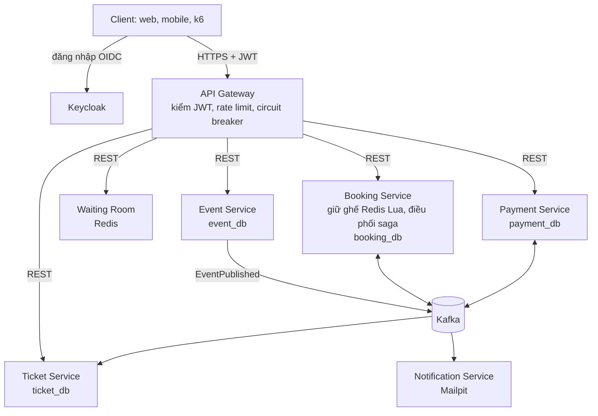
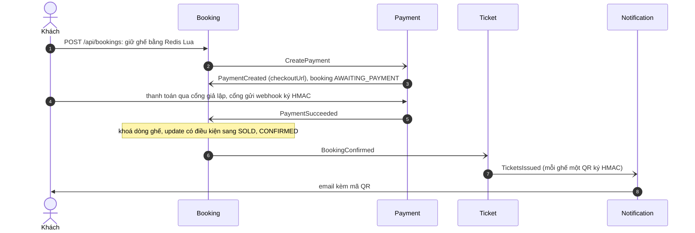

# TicketRush

[](https://github.com/trinhhung-arch/ticket-rush/actions/workflows/ci.yml)

Backend bán vé sự kiện dạng microservice, chịu được đợt mở bán đột biến mà **không bán trùng ghế**.
Java 21 · Spring Boot 4 · Spring Cloud Gateway · Keycloak · Kafka · Redis · PostgreSQL · Resilience4j · OpenTelemetry · Testcontainers · Docker Compose · Helm/Kubernetes.

> Flash sale 1.000 request/giây trong 5 phút vào sự kiện 5.000 ghế: giữ ghế p95 **10 ms**, 0 lỗi, **0 ghế bán trùng**.
> Xoá sạch Redis giữa đợt bán: vẫn 0 ghế bán trùng, 2.616/2.616 người trả tiền thừa được hoàn.
> Tắt Payment 2 phút hoặc Kafka 60 giây giữa lúc mở bán: giữ ghế không lỗi trong lúc sự cố, 0 event mất, đối soát 4 database khớp hoàn toàn.
> Chi tiết và những gì đo tải, diễn tập sự cố đã tìm ra: [báo cáo](docs/load-test-report.md). Kịch bản video demo: [docs/demo.md](docs/demo.md).

## Kiến trúc



- Gateway và từng service đều tự kiểm JWT do Keycloak cấp; vai trò được kiểm ở từng endpoint ([ADR 0006](docs/adr/0006-keycloak-jwt-checked-at-gateway-and-services.md)).
- Mỗi service có database riêng và một role Postgres riêng; không service nào đọc database của service khác.
- Service không gọi Kafka trực tiếp: message được ghi vào bảng outbox cùng transaction với dữ liệu, rồi relay đẩy lên Kafka.
- Consumer ghi `message-id` đã xử lý để bỏ qua message lặp.

### Saga đặt vé

Booking Service điều phối ([ADR 0001](docs/adr/0001-orchestrated-booking-saga.md)); mọi mũi tên qua Kafka đều đi qua outbox.



| Nhánh lỗi | Saga xử lý |
|---|---|
| Hết 10 phút chưa trả tiền | Tác vụ quét mỗi 5 giây huỷ booking (HOLD_EXPIRED), nhả ghế, gửi `CancelPayment` |
| Thẻ bị từ chối | `PaymentFailed` → huỷ booking (PAYMENT_FAILED), nhả ghế ngay |
| Tiền về sau khi booking đã huỷ | Booking gửi `RefundPayment`, Payment hoàn tiền và phát `PaymentRefunded`; khách nhận email hoàn tiền |
| Redis mất khoá, hai người cùng trả tiền một ghế | Update có điều kiện trong Postgres chỉ bán cho người đầu; người sau bị huỷ (SEAT_CONFLICT) và được hoàn tiền |
| Message hoặc webhook gửi lặp | Consumer bỏ qua `message-id` đã xử lý; payment chỉ đổi trạng thái khi còn PENDING |

## Tiến độ

| Giai đoạn | Nội dung | Trạng thái |
|---|---|---|
| 1. Nền tảng | Gateway, Event Service, giữ ghế, Outbox, Docker Compose | Xong |
| 2. Saga và thanh toán | Saga đặt vé, Payment với cổng giả lập, hết hạn giữ ghế, hoàn tiền, vé QR, email | Xong |
| 3. Quan sát | Trace xuyên Kafka và outbox (Jaeger), log theo trace (Loki), metric nghiệp vụ và cảnh báo (Prometheus, Grafana) | Xong |
| 4. Chịu tải | Waiting room, rate limit, khách tự huỷ, giới hạn 6 vé, đo tải k6 | Xong |
| 5. Bảo mật và triển khai | Keycloak và JWT, webhook ký HMAC, check-in QR, email huỷ/hoàn tiền, circuit breaker, OpenAPI, gitleaks, JaCoCo, image trong CI, Helm trên kind | Xong |

Mã yêu cầu (FR-…, NFR-…) trong code và test tham chiếu tới tài liệu FR/NFR của project.

## Chạy thử

Cần Docker (Docker Desktop hoặc OrbStack), `curl`, `jq` và `openssl`.

```bash
./scripts/init-dev-env.sh
docker compose up -d --build
./scripts/smoke-test.sh
```

`init-dev-env.sh` sinh file `.env` (đã nằm trong `.gitignore`) với mật khẩu database, khoá ký QR, secret webhook,
mật khẩu admin Keycloak và mật khẩu các tài khoản demo, tất cả ngẫu nhiên, nên repo không chứa mật khẩu nào (NFR-SEC-03).
Thiếu `.env` thì Compose dừng ngay và báo cần chạy script. Service chạy từ IDE cũng tự đọc `.env` ở thư mục gốc.

Script đăng nhập các tài khoản demo qua Keycloak rồi đi trọn luồng qua Gateway: gọi thiếu token hoặc sai vai trò bị từ chối;
tạo và công bố sự kiện; giữ ghế và gửi lại cùng `Idempotency-Key`; webhook không ký hoặc ký sai bị 401;
thanh toán, chờ CONFIRMED, lấy vé QR và email trong Mailpit; ban tổ chức quét QR, lần hai bị báo đã dùng;
một khách bị từ chối thẻ, ghế được nhả lại và khách nhận email ghi lý do; một sự kiện có waiting room; và rate limit.

Tài khoản demo (mật khẩu là `DEMO_USER_PASSWORD` trong `.env`): `organizer@ticketrush.dev` (ORGANIZER),
`admin@ticketrush.dev` (ADMIN), `alice@`, `bob@`, `chi@`, `dung@ticketrush.dev` (CUSTOMER). Tài khoản tự đăng ký nhận CUSTOMER.

| Địa chỉ | Dùng để |
|---|---|
| http://localhost:8080 | API Gateway, cổng vào duy nhất |
| http://localhost:8080/swagger-ui.html | Swagger UI cho mọi service; nút Authorize đăng nhập Keycloak (PKCE) |
| http://localhost:8180 | Keycloak, realm `ticketrush` (admin: `admin` / `KEYCLOAK_ADMIN_PASSWORD`) |
| http://localhost:8090 | Kafka UI, chỉ đọc (đăng nhập `admin` / `KAFKA_UI_LOGIN_PASSWORD`): xem topic và các topic `-dlt` |
| http://localhost:8025 | Mailpit: hộp thư test, xem email vé kèm mã QR |
| http://localhost:3000 | Grafana: dashboard "TicketRush: tổng quan", không cần đăng nhập |
| http://localhost:16686 | Jaeger: trace của từng request, xuyên qua Kafka |
| http://localhost:9090/alerts | Prometheus: 4 luật cảnh báo |

Postgres (15432), Redis (16379) và Kafka (9094) cũng được mở ra máy host, ở cổng khác mặc định để không đụng database khác trên máy; chạy một service từ IDE là tự kết nối vào stack này.
Kafka bắt đăng nhập (SASL): mỗi service có tài khoản riêng trong `.env`, và ACL chỉ cho nó ghi topic của mình, đọc topic nó cần (ADR 0009).
`./scripts/check-kafka-acls.sh` thử lại các đòn tấn công cũ: đọc trộm `ticket.events`, giả sự kiện thanh toán, vào không mật khẩu. Nếu cổng 8080 đã bận, sinh `.env` bằng `GATEWAY_PORT=18080 ./scripts/init-dev-env.sh` và gọi `GATEWAY=http://localhost:18080 ./scripts/smoke-test.sh`.

## Chạy trên Kubernetes

Cần thêm `kind`, `helm` và `kubectl`. Helm chart nằm ở `deploy/helm/ticketrush`, cài lên cụm kind 3 node (NFR-DEP-03):

```bash
./deploy/kind/up.sh          # tạo cụm, build và nạp image, helm install, chờ mọi pod sẵn sàng
./deploy/kind/pod-drills.sh  # xoá pod, kill pod, rolling restart trong lúc có tải
./deploy/kind/down.sh
```

- Mỗi service chạy **2 instance**, ưu tiên nằm trên 2 node khác nhau.
- Mỗi service có readiness/liveness/startup probe, PodDisruptionBudget, `preStop` 5 giây và graceful shutdown.
- Mật khẩu và khoá được **sinh ngẫu nhiên thành K8s Secret** khi cài lần đầu, và được giữ nguyên khi `helm upgrade`.
- Postgres, Redis, Kafka, Keycloak và Mailpit cài kèm trong chart. Khi lên môi trường thật thì tắt bằng `infrastructure.enabled=false` và dùng dịch vụ managed.
- Namespace bật Pod Security **"restricted"**: mọi pod chạy không phải root, bỏ mọi capability, seccomp `RuntimeDefault`, không mang token service account; service Java có root filesystem chỉ đọc.
- **NetworkPolicy** chặn mặc định, chỉ mở đúng đường cần (gateway tới service, service tới database/Redis/Kafka của nó). Chỉ gateway, Keycloak và giao diện Mailpit nhận kết nối từ ngoài.
- Keycloak chạy chế độ **production** (`start`) trên database riêng, không có admin console; Kafka đòi đăng nhập với ACL theo service, như trong compose (ADR 0009).
- Gateway ở http://localhost:28080, Keycloak ở :28180, Mailpit ở :28025. Smoke test chạy được nguyên trên cụm này (lệnh in ra cuối `up.sh`).

Diễn tập trên cụm kind, tải đọc đều 100 request/giây (NFR-AVAIL-04, NFR-AVAIL-06):

| Sự cố | Request lỗi |
|---|---|
| Xoá 1 pod booking-service (dừng êm) | 0 |
| Kill 1 pod event-service (`--grace-period=0`, như crash) | 0 |
| Rolling restart booking-service | 0 |
| Tổng | **0 / 10.000**, p99 22 ms |

## Kết quả đo tải

| Kịch bản | Mục tiêu | Kết quả |
|---|---|---|
| Giữ ghế ở 1.000 req/s trong 5 phút (NFR-PERF-01, 02) | p95 ≤ 200 ms, p99 ≤ 500 ms | p95 10 ms, p99 31 ms, 0 lỗi |
| Không bán trùng (NFR-CORR-01) | 0 | 0 trên 5.000 ghế |
| Xoá Redis giữa đợt bán (NFR-AVAIL-05) | 0 bán trùng | 0; 2.616 người trả tiền thừa được hoàn đủ |
| Trả tiền tới CONFIRMED (NFR-PERF-04) | p95 ≤ 3 s | p95 0,35 s |
| Danh sách sự kiện / sơ đồ 5.000 ghế (NFR-PERF-03) | p95 ≤ 150 / 300 ms | p95 6,3 / 10,8 ms |
| 50.000 người vào waiting room trong 1 phút (NFR-PERF-05) | chịu được | p95 2,8 ms, đúng 2.000 người được vào |
| Tắt Payment 2 phút giữa lúc có tải (NFR-AVAIL-01) | giữ ghế vẫn chạy, về trạng thái cuối ≤ 60 s | 0 request giữ ghế lỗi trong lúc sự cố; 2.648 booking bị treo đều CONFIRMED trong 46 s |
| Tắt Kafka 60 giây (NFR-CORR-02) | 0 event mất | 0 mất; 0 request giữ ghế lỗi; đối soát khớp hoàn toàn |
| Xoá, kill, rolling restart pod trên Kubernetes (NFR-AVAIL-04) | lỗi ≤ 1 s | 0 / 10.000 request lỗi |

Đo trên một laptop 10 CPU, k6 và 17 container chạy chung máy.
- **Đo tải:** lần đầu cho kết quả kém (p95 227 ms, saga 21 s). Năm chỗ nghẽn được tìm ra bằng metric và timestamp trong DB rồi sửa.
- **Diễn tập sự cố:** lần đầu cũng không đạt. Năm nguyên nhân được tìm ra và sửa: một bulkhead ngầm của Spring Cloud, hàng đợi accept của Tomcat, consumer KIP-848 chiếm CPU khi mất broker, rebalance chờ 5 phút, pool DB nhỏ hơn số luồng consumer.
- **Sau khi máy ngủ dậy:** notification-service bị deadlock vì consumer Kafka chạy trên virtual thread bị pin vào carrier (Java 21). Consumer giờ chạy trên platform thread.

Chi tiết trong [báo cáo](docs/load-test-report.md).

## Quan sát

Mỗi request có một trace đi qua mọi service, kể cả qua bảng outbox và Kafka ([ADR 0004](docs/adr/0004-observability-with-opentelemetry.md)).
Trace thanh toán có 12 span:

```
api-gateway           http post
payment-service       POST /api/payments/{id}/checkout
payment-service       outbox publish PaymentSucceeded → payment.events send
booking-service       payment.events process → outbox publish BookingConfirmed → booking.events send
ticket-service        booking.events process → outbox publish TicketsIssued → ticket.events send
notification-service  ticket.events process
```

- **Log:** mỗi dòng mang `trace_id`. Trong Grafana, mục Explore, chọn Loki và chạy
  `{service_name=~".+"} |= "<bookingId>"` để thấy mọi bước của một booking; bấm vào `trace_id` để mở trace trong Jaeger.
- **Dashboard** "TicketRush: tổng quan": giữ ghế mỗi giây, booking kết thúc theo lý do, thời gian từ lúc trả tiền tới
  CONFIRMED (p95, vạch 3 s của NFR-PERF-04), thanh toán theo kết quả, request/lỗi/độ trễ theo service, độ trễ outbox, Kafka consumer lag.
- **Cảnh báo** (`infra/prometheus/alerts.yml`): outbox chậm hơn 10 s, consumer tụt hơn 1.000 message, lỗi 5xx trên 1%, p95 xác nhận vượt 3 s.

Chạy service từ IDE mà muốn gửi trace và log vào stack Compose thì đặt `OTEL_EXPORT_ENABLED=true`.

## API

Mô tả OpenAPI đầy đủ ở Swagger UI của Gateway (`/swagger-ui.html`). Gọi API cần access token của Keycloak:

```bash
set -a; . ./.env; set +a
TOKEN=$(curl -s http://localhost:8180/realms/ticketrush/protocol/openid-connect/token \
  -d grant_type=password -d client_id=ticketrush-cli -d username=alice@ticketrush.dev \
  --data-urlencode "password=$DEMO_USER_PASSWORD" | jq -r .access_token)
curl -s http://localhost:$GATEWAY_PORT/api/bookings -H "Authorization: Bearer $TOKEN" | jq
```

Thiếu token hoặc token sai thì 401, sai vai trò thì 403. Mọi lỗi trả về dạng `application/problem+json` (RFC 9457).

| Method | Đường dẫn | Vai trò | Yêu cầu |
|---|---|---|---|
| POST | `/api/events` | ORGANIZER | FR-EVT-01: tạo sự kiện nháp |
| PUT | `/api/events/{id}` | ORGANIZER, chủ sự kiện | Sửa khi còn nháp; đã công bố thì 409 |
| POST | `/api/events/{id}/publish` | ORGANIZER, chủ sự kiện | FR-EVT-02: công bố, phát `EventPublished` |
| GET | `/api/events?city=&from=&to=&page=&size=` | công khai | FR-EVT-03: tối đa 50 mục một trang |
| GET | `/api/events/{id}` | công khai | FR-EVT-04; bản nháp chỉ chủ sự kiện thấy |
| GET | `/api/events/{id}/seats` | công khai | FR-BKG-01: sơ đồ ghế AVAILABLE / HELD / SOLD |
| POST | `/api/bookings` (header `Idempotency-Key`, `X-Admission-Token` nếu sự kiện có waiting room) | CUSTOMER | FR-BKG-02, 03, 04, 07: giữ 1–6 ghế trong 10 phút, tối đa 6 vé mỗi người mỗi sự kiện; vé gửi tới email của tài khoản; rate limit 10 req/s mỗi người (FR-GW-02) |
| POST | `/api/bookings/{id}/cancel` | CUSTOMER, chủ booking | FR-BKG-06: khách tự huỷ booking chưa thanh toán |
| GET | `/api/bookings` | CUSTOMER | FR-BKG-08: booking của tôi, mới nhất trước, kèm lý do huỷ |
| GET | `/api/bookings/{id}` | CUSTOMER, chủ booking | Trạng thái và `checkoutUrl` |
| POST | `/api/payments/{id}/checkout` | công khai (trang của cổng thanh toán) | FR-PAY-02: cổng giả lập, body `{"outcome":"SUCCEEDED"}` hoặc `DECLINED` |
| POST | `/api/payments/webhooks/mock-gateway` | chữ ký `X-Webhook-Signature` | FR-PAY-03, FR-PAY-04: HMAC-SHA256 trên timestamp và body; sai chữ ký hoặc cũ hơn 5 phút thì 401 |
| GET | `/api/payments/{id}`, `/api/payments?bookingId=` | CUSTOMER, chủ thanh toán | |
| GET | `/api/tickets?bookingId=` | CUSTOMER | FR-TKT-02: vé của tôi, `qrToken` để app vẽ mã QR |
| POST | `/api/tickets/check-in` body `{"eventId", "qrToken"}` | ORGANIZER của sự kiện, ADMIN | FR-TKT-03: 200 ADMITTED lần đầu; 409 ALREADY_USED kèm giờ check-in lần đầu |
| POST | `/api/queue/events/{id}/join` | CUSTOMER | FR-WR-01: vào ngay nếu còn chỗ, không thì nhận vị trí; khi vào được thì có `admissionToken` |
| GET | `/api/queue/events/{id}/status`, `/stream` (SSE) | CUSTOMER | FR-WR-02: vị trí và thời gian chờ ước tính, đẩy mỗi 2 giây |

## Bảo mật và độ bền

| Yêu cầu | Cách làm |
|---|---|
| Xác thực, phân quyền (FR-IAM-01, NFR-SEC-01) | Keycloak cấp JWT với `aud=ticketrush-api` và claim `roles`. Gateway từ chối sớm token không hợp lệ; mỗi service tự kiểm chữ ký, issuer, audience, hạn và vai trò. Vai trò được kiểm trước khi đọc body. |
| Webhook (FR-PAY-04, NFR-SEC-02) | `X-Webhook-Signature: t=…,v1=HMAC-SHA256(secret, "t.body")`, so sánh thời gian hằng, cửa sổ 5 phút ([ADR 0007](docs/adr/0007-resilience-and-signed-webhooks.md)) |
| Không lộ bí mật (NFR-SEC-03) | `.env` sinh ngẫu nhiên, K8s Secret sinh khi cài chart; gitleaks quét toàn bộ lịch sử Git trong CI |
| Vé QR (NFR-SEC-04) | Token chỉ chứa id vé và HMAC, không có dữ liệu cá nhân; check-in chỉ cho đúng ban tổ chức, mỗi vé một lần |
| Lời gọi đồng bộ (NFR-AVAIL-02) | Resilience4j ở Gateway: timeout 2 giây, mỗi service một circuit breaker, mở khi ≥ 50% lỗi trong 20 lời gọi; trả 503/504 dạng problem+json |
| Tắt êm (NFR-AVAIL-06) | Graceful shutdown 30 giây; trên Kubernetes thêm `preStop` 5 giây và `terminationGracePeriodSeconds` 40 |

## Test

```bash
./mvnw verify
```

Integration test chạy với Postgres, Kafka, Redis, Mailpit và Keycloak thật qua Testcontainers.
CI (`.github/workflows/ci.yml`) chạy song song gitleaks trên toàn bộ lịch sử Git, `helm lint` và `./mvnw verify`, rồi build image của 7 service (push lên GHCR khi merge vào main).

JaCoCo đo độ phủ mọi module (`*/target/site/jacoco/index.html`); booking-service và payment-service làm build thất bại nếu
độ phủ dòng hoặc nhánh dưới 70% (NFR-TEST-01). Hiện tại: booking 95% dòng, 79% nhánh; payment 94% dòng, 78% nhánh.

| Test | Kiểm chứng |
|---|---|
| `BookingIntegrationTest.oneThousandCustomersRaceForOneSeatAndExactlyOneWins` | FR-BKG-03, NFR-TEST-03 |
| `BookingIntegrationTest.holdsAreAllOrNothing` | FR-BKG-02 |
| `BookingIntegrationTest.replayingAnIdempotencyKeyReturnsTheSameBooking` | FR-BKG-04 |
| `BookingIntegrationTest.seatMapShowsLiveHolds` | FR-BKG-01 |
| `BookingSagaIntegrationTest.paidBookingIsConfirmedAndItsSeatsSold` | FR-BKG-09 |
| `BookingSagaIntegrationTest.expiredHoldIsCancelledAndItsPaymentStopped` | FR-BKG-05 |
| `BookingSagaIntegrationTest.paymentArrivingAfterExpiryIsRefunded` | FR-PAY-06 |
| `BookingSagaIntegrationTest.databaseGuardRefundsTheSecondPayerWhenRedisLosesItsHolds` | NFR-AVAIL-05, NFR-CORR-01 |
| `BookingSagaIntegrationTest.redeliveredPaymentEventsAreAppliedOnce` | NFR-CORR-03 |
| `PaymentIntegrationTest.repeatedWebhooksAreAppliedOnce` | FR-PAY-02, FR-PAY-03 |
| `PaymentIntegrationTest.paymentAfterTheHoldEndedIsRefused` | FR-PAY-05 |
| `TicketIntegrationTest.issuesOneSignedTicketPerSeatOnce` | FR-TKT-01 |
| `TicketTokensTest` | NFR-SEC-04: token QR không làm giả được |
| `TicketEmailIntegrationTest` | FR-NTF-01, gửi thật qua Mailpit |
| `EventApiIntegrationTest.publishingAnnouncesTheEventOnKafkaExactlyOnce` | FR-EVT-02, Outbox |
| `EventApiIntegrationTest.draftIsHiddenUntilPublishedAndThenLocked` | FR-EVT-02, FR-EVT-03 |
| `ObservabilityIntegrationTest` | NFR-OBS-01: trace đi qua outbox vào Kafka; NFR-OBS-02: metric nghiệp vụ |
| `BookingIntegrationTest.parallelRequestsFromOneCustomerCannotExceedTheLimit` | FR-BKG-07: 5 request song song, đúng 3 qua (6 vé) |
| `BookingIntegrationTest.waitingRoomEventsRequireAnAdmissionTokenForThatBuyerAndEvent` | FR-WR-03: token sai người, sai sự kiện, hết hạn, sai khoá đều bị 403 |
| `BookingSagaIntegrationTest.customerCanCancelAnUnpaidBookingButNotAPaidOne` | FR-BKG-06 |
| `WaitingRoomIntegrationTest` | FR-WR-01, 02, 03: FIFO, SSE, JWT |
| `RateLimitTest` | FR-GW-02, NFR-SEC-06 với Redis thật |
| `RoutingTest` | FR-GW-01; NFR-SEC-01: thiếu token, token ký sai khoá đều 401 ở Gateway |
| `KeycloakRealmTest` | FR-IAM-01 với Keycloak thật: realm, vai trò mặc định CUSTOMER, audience |
| `ResourceServerTest` | NFR-SEC-01, 05: 401/403 dạng problem+json, vai trò kiểm trước khi validate body, OpenAPI |
| `EventApiIntegrationTest.onlyOrganizersChangeTheCatalogue` | FR-IAM-01: customer tạo sự kiện bị 403 |
| `BookingIntegrationTest.bookingNeedsACustomerToken` | FR-IAM-01: booking gắn với `sub` và email của token |
| `PaymentIntegrationTest.onlyFreshCorrectlySignedWebhooksAreAccepted` | FR-PAY-04: không ký, ký sai, sửa body, gửi lại sau 6 phút đều 401 |
| `TicketIntegrationTest.aTicketGetsInOnceAndOnlyThroughItsOrganizer` | FR-TKT-03 |
| `TicketIntegrationTest.simultaneousScansAdmitExactlyOnce` | FR-TKT-03: 20 lần quét đồng thời, đúng 1 được vào |
| `CancellationEmailIntegrationTest` | FR-NTF-02: email ghi lý do; email hoàn tiền dù hai event đến theo thứ tự nào |
| `ResilienceTest` | NFR-AVAIL-02: cắt ở 2 giây; breaker mở sau 20 lỗi và không gọi service nữa |

## Cấu trúc

```
services/                 7 ứng dụng Spring Boot, mỗi cái một image
  api-gateway/            định tuyến, kiểm JWT, rate limit, circuit breaker, Swagger UI
  event-service/          sự kiện, khu ghế, giờ mở bán
  booking-service/        kho ghế, giữ ghế (src/main/resources/redis/*.lua), booking, điều phối saga
  payment-service/        thanh toán, cổng giả lập, webhook, hoàn tiền
  ticket-service/         vé điện tử, token QR ký HMAC
  notification-service/   email vé kèm mã QR (zxing) qua SMTP
  waiting-room-service/   hàng đợi ảo trong Redis (Lua), vé vào cửa JWT, SSE
libs/                     thư viện dùng chung, không có main class
  observability/          OpenTelemetry, Prometheus, Logback gửi OTLP, cấu hình quan sát dùng chung
  security/               resource server JWT dùng chung: Caller, @CustomerOnly/@OrganizerOnly, 401/403 problem+json, OpenAPI
  contracts/              message và DTO giữa các service, chia package theo service phát hành; Java thuần
  messaging/              cấu hình Kafka, transactional outbox, idempotent consumer
  web/                    lỗi problem+json, phân trang, header dùng chung cho REST API
  test-support/           Testcontainers dùng chung và luật kiến trúc ArchUnit (chỉ scope test)
load-test/                kịch bản k6: flash sale, waiting room, API đọc, diễn tập sự cố
deploy/helm/ticketrush/   Helm chart: 7 service x 2 instance, hạ tầng, Secret sinh tự động
deploy/kind/              cụm kind 3 node và script dựng
infra/keycloak/           realm ticketrush: vai trò, client, tài khoản demo
infra/postgres/           tạo database và role riêng cho từng service
infra/kafka/              tạo topic và ACL theo từng service
infra/otel-collector/     nhận OTLP, chuyển trace sang Jaeger, log sang Loki
infra/prometheus/         scrape và luật cảnh báo
infra/grafana/            datasource và dashboard nạp sẵn
docs/adr/                 các quyết định kiến trúc
scripts/                  smoke test end-to-end, đối soát cuối đợt, kiểm tra bán trùng, kiểm tra ACL Kafka
```

## Quyết định kiến trúc

- [ADR 0001: Saga đặt vé dạng điều phối](docs/adr/0001-orchestrated-booking-saga.md)
- [ADR 0002: Giữ ghế bằng Redis Lua, database là lớp chặn cuối](docs/adr/0002-seat-holds-in-redis-with-database-guard.md)
- [ADR 0003: Transactional Outbox và consumer idempotent](docs/adr/0003-transactional-outbox-with-polling-publisher.md)
- [ADR 0004: Quan sát bằng OpenTelemetry, trace đi xuyên qua outbox](docs/adr/0004-observability-with-opentelemetry.md)
- [ADR 0005: Waiting room bằng Redis sorted set, vé vào cửa là JWT](docs/adr/0005-waiting-room-in-redis-with-jwt-admission.md)
- [ADR 0006: Keycloak cấp JWT, Gateway và từng service đều kiểm tra](docs/adr/0006-keycloak-jwt-checked-at-gateway-and-services.md)
- [ADR 0007: Circuit breaker ở Gateway, webhook ký HMAC](docs/adr/0007-resilience-and-signed-webhooks.md)
- [ADR 0008: Cấu trúc source: services/ và libs/, một bộ package chung, kiểm bằng ArchUnit](docs/adr/0008-source-layout-services-libs-and-package-rules.md)
- [ADR 0009: Siết hạ tầng: Kafka đăng nhập và ACL theo service, Keycloak production, pod "restricted", NetworkPolicy](docs/adr/0009-infrastructure-hardening.md)

## Tham khảo

- [microservices-patterns/ftgo-application](https://github.com/microservices-patterns/ftgo-application): Saga, Outbox (sách *Microservices Patterns*)
- [piomin/sample-spring-kafka-microservices](https://github.com/piomin/sample-spring-kafka-microservices): Saga với Kafka trên Spring Boot
- [debezium-examples/outbox](https://github.com/debezium/debezium-examples/tree/HEAD/outbox): Outbox và loại bỏ message trùng
- [Hello Interview: Design Ticketmaster](https://www.hellointerview.com/learn/system-design/problem-breakdowns/ticketmaster): giữ ghế, waiting room
- [keycloak/keycloak-quickstarts](https://github.com/keycloak/keycloak-quickstarts): realm, client và resource server
- [resilience4j/resilience4j](https://github.com/resilience4j/resilience4j): circuit breaker, time limiter
- [GoogleCloudPlatform/microservices-demo](https://github.com/GoogleCloudPlatform/microservices-demo): triển khai nhiều service lên Kubernetes
