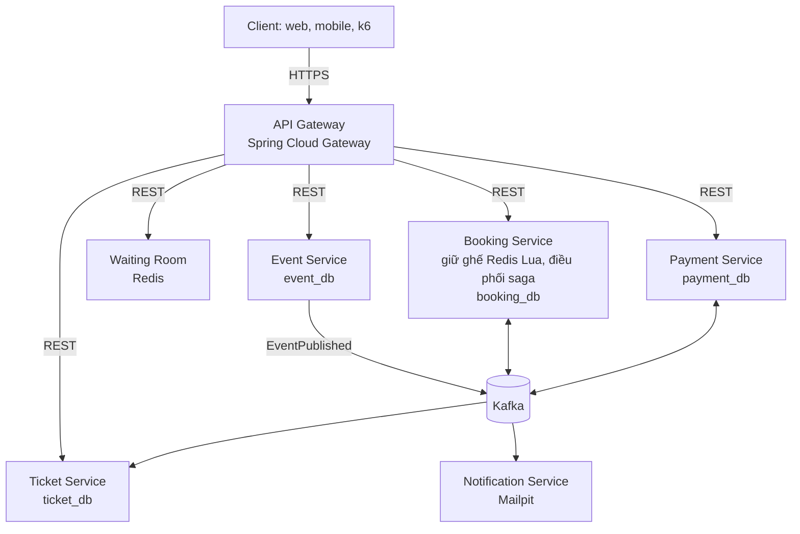

# TicketRush

[](https://github.com/trinhhung-arch/ticket-rush/actions/workflows/ci.yml)

Backend bán vé sự kiện dạng microservice, chịu được đợt mở bán đột biến mà **không bán trùng ghế**.
Java 21 · Spring Boot 4 · Spring Cloud Gateway · Kafka · Redis · PostgreSQL · Testcontainers · Docker Compose.

> 1.000 request đồng thời cùng giữ một ghế: đúng 1 thành công, 999 nhận 409, xử lý xong trong khoảng 0,5 giây
> (`BookingIntegrationTest`, máy dev 10 CPU).

## Kiến trúc



- Mỗi service có database riêng và một role Postgres riêng; không service nào đọc database của service khác.
- Service không gọi Kafka trực tiếp: message được ghi vào bảng outbox cùng transaction với dữ liệu, rồi relay đẩy lên Kafka.
- Consumer ghi `message-id` đã xử lý để bỏ qua message lặp.

## Tiến độ

| Giai đoạn | Nội dung | Trạng thái |
|---|---|---|
| 1. Nền tảng | Gateway, Event Service, giữ ghế, Outbox, Docker Compose | Xong |
| 2. Saga và thanh toán | Payment, hết hạn giữ ghế, hoàn tiền, phát vé, email | Chưa làm (service đã có khung) |
| 3. Quan sát | OpenTelemetry, Prometheus, Grafana, Loki | Chưa làm |
| 4. Chịu tải | Waiting room, rate limit, load test k6 | Chưa làm |
| 5. Bảo mật và triển khai | Keycloak, Resilience4j, Helm, Kubernetes | Chưa làm |

Mã yêu cầu (FR-…, NFR-…) trong code và test tham chiếu tới tài liệu FR/NFR của project.

## Chạy thử

Cần Docker (Docker Desktop hoặc OrbStack), `curl` và `jq`.

```bash
docker compose up -d --build
./scripts/smoke-test.sh
```

Script đi qua giai đoạn 1 bằng Gateway: tạo và công bố sự kiện, chờ Booking dựng sơ đồ ghế từ Kafka,
giữ ghế, gửi lại cùng `Idempotency-Key`, và cho thấy người thứ hai không lấy được ghế đang bị giữ.

| Địa chỉ | Dùng để |
|---|---|
| http://localhost:8080 | API Gateway, cổng vào duy nhất |
| http://localhost:8090 | Kafka UI: xem topic `event.events` và các topic `-dlt` |
| http://localhost:8025 | Mailpit: hộp thư test (từ giai đoạn 2) |

Postgres (15432), Redis (16379) và Kafka (9094) cũng được mở ra máy host, ở cổng khác mặc định để không đụng database khác trên máy; chạy một service từ IDE là tự kết nối vào stack này. Nếu cổng 8080 đã bận, đặt `GATEWAY_PORT` trong `.env` (xem `.env.example`) và gọi script với `GATEWAY=http://localhost:<cổng> ./scripts/smoke-test.sh`.

## API giai đoạn 1

Danh tính người gọi tạm lấy từ header `X-User-Id`; Keycloak thay thế ở giai đoạn 5.
Mọi lỗi trả về dạng `application/problem+json` (RFC 9457).

| Method | Đường dẫn | Service | Yêu cầu |
|---|---|---|---|
| POST | `/api/events` | event | FR-EVT-01: tạo sự kiện nháp |
| PUT | `/api/events/{id}` | event | Sửa khi còn nháp; đã công bố thì 409 |
| POST | `/api/events/{id}/publish` | event | FR-EVT-02: công bố, phát `EventPublished` |
| GET | `/api/events?city=&from=&to=&page=&size=` | event | FR-EVT-03: tối đa 50 mục một trang |
| GET | `/api/events/{id}` | event | FR-EVT-04 |
| GET | `/api/events/{id}/seats` | booking | FR-BKG-01: sơ đồ ghế AVAILABLE / HELD / SOLD |
| POST | `/api/bookings` (header `Idempotency-Key`) | booking | FR-BKG-02, 03, 04: giữ 1–6 ghế trong 10 phút |
| GET | `/api/bookings/{id}` | booking | Chỉ chủ booking xem được |

## Test

```bash
./mvnw verify
```

Integration test chạy với Postgres, Kafka và Redis thật qua Testcontainers.

| Test | Kiểm chứng |
|---|---|
| `BookingIntegrationTest.oneThousandCustomersRaceForOneSeatAndExactlyOneWins` | FR-BKG-03, NFR-TEST-03 |
| `BookingIntegrationTest.holdsAreAllOrNothing` | FR-BKG-02 |
| `BookingIntegrationTest.replayingAnIdempotencyKeyReturnsTheSameBooking` | FR-BKG-04 |
| `BookingIntegrationTest.seatMapShowsLiveHolds` | FR-BKG-01 |
| `EventApiIntegrationTest.publishingAnnouncesTheEventOnKafkaExactlyOnce` | FR-EVT-02, Outbox |
| `EventApiIntegrationTest.draftIsHiddenUntilPublishedAndThenLocked` | FR-EVT-02, FR-EVT-03 |
| `RoutingTest` | FR-GW-01 |

## Cấu trúc

```
common/                 service chassis dùng chung: outbox, idempotent consumer, contract message, xử lý lỗi
api-gateway/            định tuyến; sau này thêm JWT và rate limit
event-service/          sự kiện, khu ghế, giờ mở bán
booking-service/        kho ghế, giữ ghế (src/main/resources/redis/*.lua), booking, saga
payment-service/        khung, làm ở giai đoạn 2
ticket-service/         khung, làm ở giai đoạn 2
notification-service/   khung, làm ở giai đoạn 2
waiting-room-service/   khung, làm ở giai đoạn 4
infra/postgres/         tạo database và role riêng cho từng service
docs/adr/               các quyết định kiến trúc
scripts/                smoke test end-to-end
```

## Quyết định kiến trúc

- [ADR 0001: Saga đặt vé dạng điều phối](docs/adr/0001-orchestrated-booking-saga.md)
- [ADR 0002: Giữ ghế bằng Redis Lua, database là lớp chặn cuối](docs/adr/0002-seat-holds-in-redis-with-database-guard.md)
- [ADR 0003: Transactional Outbox và consumer idempotent](docs/adr/0003-transactional-outbox-with-polling-publisher.md)

## Tham khảo

- [microservices-patterns/ftgo-application](https://github.com/microservices-patterns/ftgo-application): Saga, Outbox (sách *Microservices Patterns*)
- [piomin/sample-spring-kafka-microservices](https://github.com/piomin/sample-spring-kafka-microservices): Saga với Kafka trên Spring Boot
- [debezium-examples/outbox](https://github.com/debezium/debezium-examples/tree/HEAD/outbox): Outbox và loại bỏ message trùng
- [Hello Interview: Design Ticketmaster](https://www.hellointerview.com/learn/system-design/problem-breakdowns/ticketmaster): giữ ghế, waiting room
