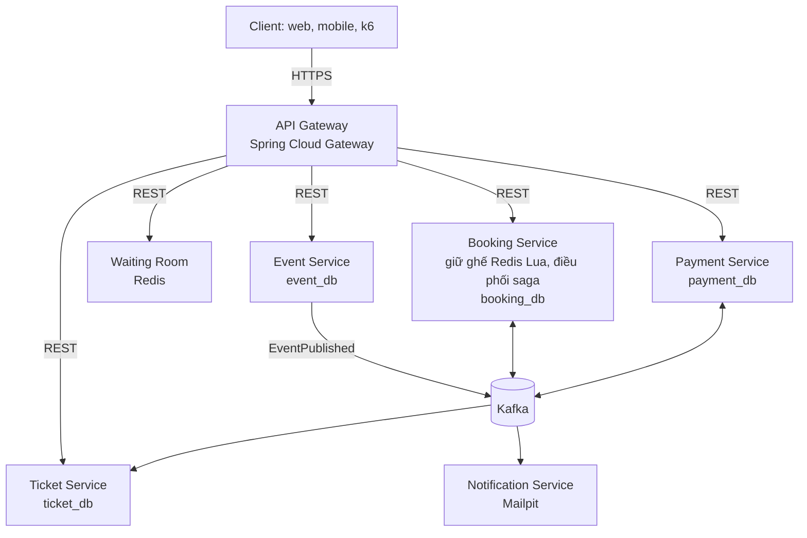
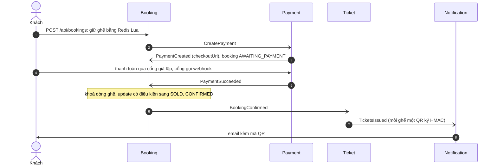

# TicketRush

[](https://github.com/trinhhung-arch/ticket-rush/actions/workflows/ci.yml)

Backend bán vé sự kiện dạng microservice, chịu được đợt mở bán đột biến mà **không bán trùng ghế**.
Java 21 · Spring Boot 4 · Spring Cloud Gateway · Kafka · Redis · PostgreSQL · Testcontainers · Docker Compose.

> 1.000 request đồng thời cùng giữ một ghế: đúng 1 thành công, 999 nhận 409, xử lý xong trong khoảng 0,5 giây
> (`BookingIntegrationTest`, máy dev 10 CPU).

## Kiến trúc



- Mỗi service có database riêng và một role Postgres riêng; không service nào đọc database của service khác.
- Service không gọi Kafka trực tiếp: message được ghi vào bảng outbox cùng transaction với dữ liệu, rồi relay đẩy lên Kafka.
- Consumer ghi `message-id` đã xử lý để bỏ qua message lặp.

### Saga đặt vé

Booking Service điều phối ([ADR 0001](docs/adr/0001-orchestrated-booking-saga.md)); mọi mũi tên qua Kafka đều đi qua outbox.



| Nhánh lỗi | Saga xử lý |
|---|---|
| Hết 10 phút chưa trả tiền | Tác vụ quét mỗi 5 giây huỷ booking (HOLD_EXPIRED), nhả ghế, gửi `CancelPayment` |
| Thẻ bị từ chối | `PaymentFailed` → huỷ booking (PAYMENT_FAILED), nhả ghế ngay |
| Tiền về sau khi booking đã huỷ | Booking gửi `RefundPayment`, Payment hoàn tiền và phát `PaymentRefunded` |
| Redis mất khoá, hai người cùng trả tiền một ghế | Update có điều kiện trong Postgres chỉ bán cho người đầu; người sau bị huỷ (SEAT_CONFLICT) và được hoàn tiền |
| Message hoặc webhook gửi lặp | Consumer bỏ qua `message-id` đã xử lý; payment chỉ đổi trạng thái khi còn PENDING |

## Tiến độ

| Giai đoạn | Nội dung | Trạng thái |
|---|---|---|
| 1. Nền tảng | Gateway, Event Service, giữ ghế, Outbox, Docker Compose | Xong |
| 2. Saga và thanh toán | Saga đặt vé, Payment với cổng giả lập, hết hạn giữ ghế, hoàn tiền, vé QR, email | Xong |
| 3. Quan sát | Trace xuyên Kafka và outbox (Jaeger), log theo trace (Loki), metric nghiệp vụ và cảnh báo (Prometheus, Grafana) | Xong |
| 4. Chịu tải | Waiting room, rate limit, load test k6 | Chưa làm |
| 5. Bảo mật và triển khai | Keycloak, Resilience4j, Helm, Kubernetes | Chưa làm |

Mã yêu cầu (FR-…, NFR-…) trong code và test tham chiếu tới tài liệu FR/NFR của project.

## Chạy thử

Cần Docker (Docker Desktop hoặc OrbStack), `curl` và `jq`.

```bash
./scripts/init-dev-env.sh
docker compose up -d --build
./scripts/smoke-test.sh
```

`init-dev-env.sh` sinh file `.env` (đã nằm trong `.gitignore`) với mật khẩu database và khoá ký QR ngẫu nhiên,
nên repo không chứa mật khẩu nào (NFR-SEC-03). Thiếu `.env` thì Compose dừng ngay và báo cần chạy script.
Service chạy từ IDE cũng tự đọc `.env` ở thư mục gốc.

Script đi trọn luồng qua Gateway: tạo và công bố sự kiện, giữ ghế, gửi lại cùng `Idempotency-Key`,
thanh toán qua cổng giả lập, chờ booking CONFIRMED, lấy vé QR và kiểm tra email trong Mailpit;
cuối cùng một khách bị từ chối thẻ và ghế được nhả lại.

| Địa chỉ | Dùng để |
|---|---|
| http://localhost:8080 | API Gateway, cổng vào duy nhất |
| http://localhost:8090 | Kafka UI: xem topic `event.events` và các topic `-dlt` |
| http://localhost:8025 | Mailpit: hộp thư test, xem email vé kèm mã QR |
| http://localhost:3000 | Grafana: dashboard "TicketRush: tổng quan", không cần đăng nhập |
| http://localhost:16686 | Jaeger: trace của từng request, xuyên qua Kafka |
| http://localhost:9090/alerts | Prometheus: 4 luật cảnh báo |

Postgres (15432), Redis (16379) và Kafka (9094) cũng được mở ra máy host, ở cổng khác mặc định để không đụng database khác trên máy; chạy một service từ IDE là tự kết nối vào stack này. Nếu cổng 8080 đã bận, sinh `.env` bằng `GATEWAY_PORT=18080 ./scripts/init-dev-env.sh` và gọi `GATEWAY=http://localhost:18080 ./scripts/smoke-test.sh`.

## Quan sát

Mỗi request có một trace đi qua mọi service, kể cả qua bảng outbox và Kafka ([ADR 0004](docs/adr/0004-observability-with-opentelemetry.md)).
Trace thanh toán có 12 span:

```
api-gateway           http post
payment-service       POST /api/payments/{id}/checkout
payment-service       outbox publish PaymentSucceeded → payment.events send
booking-service       payment.events process → outbox publish BookingConfirmed → booking.events send
ticket-service        booking.events process → outbox publish TicketsIssued → ticket.events send
notification-service  ticket.events process
```

- **Log:** mỗi dòng mang `trace_id`. Trong Grafana, mục Explore, chọn Loki và chạy
  `{service_name=~".+"} |= "<bookingId>"` để thấy mọi bước của một booking; bấm vào `trace_id` để mở trace trong Jaeger.
- **Dashboard** "TicketRush: tổng quan": giữ ghế mỗi giây, booking kết thúc theo lý do, thời gian từ lúc trả tiền tới
  CONFIRMED (p95, vạch 3 s của NFR-PERF-04), thanh toán theo kết quả, request/lỗi/độ trễ theo service, độ trễ outbox, Kafka consumer lag.
- **Cảnh báo** (`infra/prometheus/alerts.yml`): outbox chậm hơn 10 s, consumer tụt hơn 1.000 message, lỗi 5xx trên 1%, p95 xác nhận vượt 3 s.

Chạy service từ IDE mà muốn gửi trace và log vào stack Compose thì đặt `OTEL_EXPORT_ENABLED=true`.

## API

Danh tính người gọi tạm lấy từ header `X-User-Id`; Keycloak thay thế ở giai đoạn 5.
Mọi lỗi trả về dạng `application/problem+json` (RFC 9457).

| Method | Đường dẫn | Service | Yêu cầu |
|---|---|---|---|
| POST | `/api/events` | event | FR-EVT-01: tạo sự kiện nháp |
| PUT | `/api/events/{id}` | event | Sửa khi còn nháp; đã công bố thì 409 |
| POST | `/api/events/{id}/publish` | event | FR-EVT-02: công bố, phát `EventPublished` |
| GET | `/api/events?city=&from=&to=&page=&size=` | event | FR-EVT-03: tối đa 50 mục một trang |
| GET | `/api/events/{id}` | event | FR-EVT-04 |
| GET | `/api/events/{id}/seats` | booking | FR-BKG-01: sơ đồ ghế AVAILABLE / HELD / SOLD |
| POST | `/api/bookings` (header `Idempotency-Key`) | booking | FR-BKG-02, 03, 04: giữ 1–6 ghế trong 10 phút |
| GET | `/api/bookings` | booking | FR-BKG-08: booking của tôi, mới nhất trước, kèm lý do huỷ |
| GET | `/api/bookings/{id}` | booking | Trạng thái và `checkoutUrl`; chỉ chủ booking xem được |
| POST | `/api/payments/{id}/checkout` | payment | FR-PAY-02: cổng giả lập, body `{"outcome":"SUCCEEDED"}` hoặc `DECLINED` |
| POST | `/api/payments/webhooks/mock-gateway` | payment | FR-PAY-03: webhook, gửi lặp vẫn an toàn |
| GET | `/api/payments/{id}`, `/api/payments?bookingId=` | payment | Chỉ chủ thanh toán xem được |
| GET | `/api/tickets?bookingId=` | ticket | FR-TKT-02: vé của tôi, `qrToken` để app vẽ mã QR |

## Test

```bash
./mvnw verify
```

Integration test chạy với Postgres, Kafka và Redis thật qua Testcontainers.

| Test | Kiểm chứng |
|---|---|
| `BookingIntegrationTest.oneThousandCustomersRaceForOneSeatAndExactlyOneWins` | FR-BKG-03, NFR-TEST-03 |
| `BookingIntegrationTest.holdsAreAllOrNothing` | FR-BKG-02 |
| `BookingIntegrationTest.replayingAnIdempotencyKeyReturnsTheSameBooking` | FR-BKG-04 |
| `BookingIntegrationTest.seatMapShowsLiveHolds` | FR-BKG-01 |
| `BookingSagaIntegrationTest.paidBookingIsConfirmedAndItsSeatsSold` | FR-BKG-09 |
| `BookingSagaIntegrationTest.expiredHoldIsCancelledAndItsPaymentStopped` | FR-BKG-05 |
| `BookingSagaIntegrationTest.paymentArrivingAfterExpiryIsRefunded` | FR-PAY-06 |
| `BookingSagaIntegrationTest.databaseGuardRefundsTheSecondPayerWhenRedisLosesItsHolds` | NFR-AVAIL-05, NFR-CORR-01 |
| `BookingSagaIntegrationTest.redeliveredPaymentEventsAreAppliedOnce` | NFR-CORR-03 |
| `PaymentIntegrationTest.repeatedWebhooksAreAppliedOnce` | FR-PAY-02, FR-PAY-03 |
| `PaymentIntegrationTest.paymentAfterTheHoldEndedIsRefused` | FR-PAY-05 |
| `TicketIntegrationTest.issuesOneSignedTicketPerSeatOnce` | FR-TKT-01 |
| `TicketTokensTest` | NFR-SEC-04: token QR không làm giả được |
| `TicketEmailIntegrationTest` | FR-NTF-01, gửi thật qua Mailpit |
| `EventApiIntegrationTest.publishingAnnouncesTheEventOnKafkaExactlyOnce` | FR-EVT-02, Outbox |
| `EventApiIntegrationTest.draftIsHiddenUntilPublishedAndThenLocked` | FR-EVT-02, FR-EVT-03 |
| `ObservabilityIntegrationTest` | NFR-OBS-01: trace đi qua outbox vào Kafka; NFR-OBS-02: metric nghiệp vụ |
| `RoutingTest` | FR-GW-01 |

## Cấu trúc

```
observability/          OpenTelemetry, Prometheus, Logback gửi OTLP, cấu hình quan sát dùng chung
common/                 service chassis dùng chung: outbox, idempotent consumer, contract message, xử lý lỗi
api-gateway/            định tuyến; sau này thêm JWT và rate limit
event-service/          sự kiện, khu ghế, giờ mở bán
booking-service/        kho ghế, giữ ghế (src/main/resources/redis/*.lua), booking, điều phối saga
payment-service/        thanh toán, cổng giả lập, webhook, hoàn tiền
ticket-service/         vé điện tử, token QR ký HMAC
notification-service/   email vé kèm mã QR (zxing) qua SMTP
waiting-room-service/   khung, làm ở giai đoạn 4
infra/postgres/         tạo database và role riêng cho từng service
infra/otel-collector/   nhận OTLP, chuyển trace sang Jaeger, log sang Loki
infra/prometheus/       scrape và luật cảnh báo
infra/grafana/          datasource và dashboard nạp sẵn
docs/adr/               các quyết định kiến trúc
scripts/                smoke test end-to-end
```

## Quyết định kiến trúc

- [ADR 0001: Saga đặt vé dạng điều phối](docs/adr/0001-orchestrated-booking-saga.md)
- [ADR 0002: Giữ ghế bằng Redis Lua, database là lớp chặn cuối](docs/adr/0002-seat-holds-in-redis-with-database-guard.md)
- [ADR 0003: Transactional Outbox và consumer idempotent](docs/adr/0003-transactional-outbox-with-polling-publisher.md)
- [ADR 0004: Quan sát bằng OpenTelemetry, trace đi xuyên qua outbox](docs/adr/0004-observability-with-opentelemetry.md)

## Tham khảo

- [microservices-patterns/ftgo-application](https://github.com/microservices-patterns/ftgo-application): Saga, Outbox (sách *Microservices Patterns*)
- [piomin/sample-spring-kafka-microservices](https://github.com/piomin/sample-spring-kafka-microservices): Saga với Kafka trên Spring Boot
- [debezium-examples/outbox](https://github.com/debezium/debezium-examples/tree/HEAD/outbox): Outbox và loại bỏ message trùng
- [Hello Interview: Design Ticketmaster](https://www.hellointerview.com/learn/system-design/problem-breakdowns/ticketmaster): giữ ghế, waiting room
